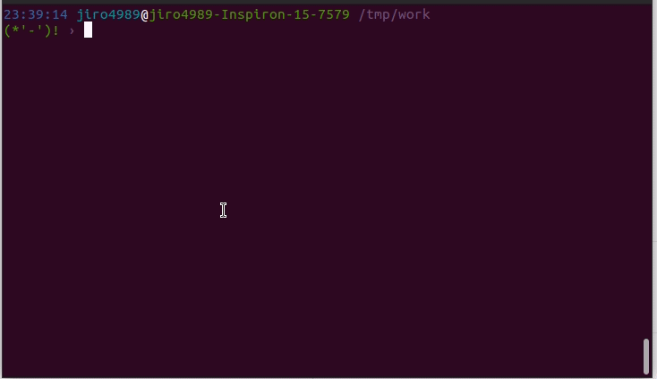

====
rena
====

|gh-actions| |nimble-version| |nimble-install|

rena is a tiny file/directory renaming command.

|demo-replace|

.. contents:: Table of contents
   :depth: 3

Overview
========

I hate a file name that has whitespace.
Sometimes, it occurs a bug of program (Especially, shell script).
Renaming is boring and takes times.
So I created ``rena`` command. This will resolve this problem.

Development
===========

Nim 1.0.6

Usage
=====

You can do ``dry-run`` with ``-d`` or ``--dry-run``.
It means that you can check file name before real renaming with your eyes.
Files or directories will be renamed if you didn't use ``-d`` options.

replace
-------

``replace`` sub-command runs replacing characters, ``--from-str`` to ``--to-str``.
``replace`` replaces whitespace in default.

This code runs dry-run.

.. code-block:: shell

   $ rena replace --dry-run -t _ target_dir

   # or

   $ rena replace -d -t _ target_dir

This code actually runs renaming.

.. code-block:: shell

   $ rena replace -t _ target_dir

   # '-p' prints results

   $ rena replace -p -t _ target_dir

You should use the ``--from-strs`` or ``-f`` options if you want to replace multiple characters.

Examples: Replacing ``(`` and ``)`` to ``_`` .

.. code-block:: shell

   $ rena replace -f '(' -f ')' -t "_" target_dir

delete
------

You should use the ``delete`` sub-command if you want to delete characters.
``delete`` deletes whitespace in default.

.. code-block:: shell

   $ rena delete target_dir

You should use ``-f`` options if you change delete target characters.

.. code-block:: shell

   $ rena delete -f '(' -f ')' target_dir

lower
-----

``lower`` sub-command renames *all* characters to lower character.

.. code-block:: shell

   $ rena lower target_dir

upper
-----

``upper`` sub-command renames *all* characters to upper character.

.. code-block:: shell

   $ rena upper target_dir

Install
=======

.. code-block:: shell

   nimble install rena

Download binary from `Release <https://github.com/jiro4989/rena/releases>`_.

License
=======

MIT

.. |gh-actions| image:: https://github.com/jiro4989/rena/workflows/build/badge.svg
   :target: https://github.com/jiro4989/rena/actions
.. |nimble-version| image:: https://nimble.directory/ci/badges/rena/version.svg
   :target: https://nimble.directory/ci/badges/rena/nimdevel/output.html
.. |nimble-install| image:: https://nimble.directory/ci/badges/rena/nimdevel/status.svg
   :target: https://nimble.directory/ci/badges/rena/nimdevel/output.html

